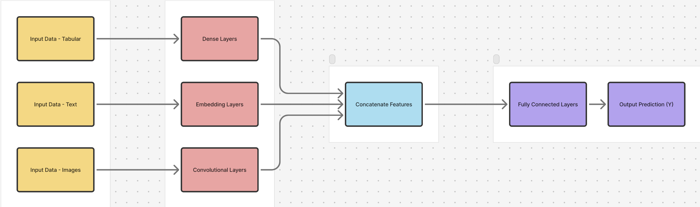

# Deep Learning Starter
Hi, welcome to Hack@Brown's Deep Learning starter kit. We will go over how to set up your environment
to build deep learning models and also some of the most useful packages. The main goal of this starter
kit is to equip you with the tools to be able to build and train neural networks that can learn
features from large datasets of various types including text, images, and/or audio. For a conprehensive
conceptual overview of deep learning please refer to this website: https://www.ibm.com/think/topics/deep-learning.

## Getting Started
This repository includes a very simple neural network and training scripts in a flexible structure
for you to experiment with and build off of using your own data and architecture. The model supports
both mainstream deep learning libraries: PyTorch and TensorFlow. 
### PyTorch:
A flexible, Pythonic deep learning framework widely used for research, prototyping, and education.
PyTorch is known for its intuitive syntax and dynamic computation graph, making it easy to experiment
with new architectures like CNNs, RNNs, and Transformers. It’s great for quickly testing ideas and 
building models for computer vision, natural language processing, or any custom AI task. 

**Learn More:** [PyTorch Tutorials](https://pytorch.org/tutorials/)
### TensorFlow:
A powerful deep learning framework built for both experimentation and large-scale production. 
TensorFlow integrates seamlessly with Keras, its high-level API, so you can start with simple models 
and scale up easily. It’s ideal for projects that may eventually deploy models on mobile 
(TensorFlow Lite), web (TensorFlow.js), or the cloud (Vertex AI, AWS, etc.), and it includes rich 
visualization tools like TensorBoard for monitoring training.

**Learn more:**
- [TensorFlow Tutorials](https://www.tensorflow.org/tutorials) 
- [Keras API Reference](https://keras.io/api/)

## Instructions
To get the basic neural network and training scripts contained in this starter pack, simply clone
this repository and run 
```bash
pip install -r requirements.txt
```
 to install the required dependencies. In
order to run your model, run 
```bash
python src/train.py --framework pytorch 
```
or 
```bash
python src/train.py --framework tensorflow 
```
depending on which framework you would like your model use. 

There are also blank versions of all the relevant files for you to fill out if you would like a more hands-on learning experience or want to use it as a stencil for coding your own model. [**Please note:** if you want to train and run the blank versions, replace all terminal commands given above with the corresponding blank file name, ex: `python src/train_blank.py --framework pytorch`]
### What's Included:
The diagram below shows the overall framework of the simple model that is included:


There are two main Python scripts included in this starter pack:

`train.py`

This file handles the end-to-end training process — from preparing data to saving the trained model for later use.
- **Loads the dataset:**
By default, the starter uses MNIST, a classic dataset of handwritten digits (0–9). Each image is 28×28 pixels in grayscale. The goal is to train a model that can correctly classify which digit (0–9) appears in a given image.
- **Defines the model:**
The starter uses a small feedforward neural network (also called a multilayer perceptron). It has:
    - An input layer that flattens the 28×28 image into a 784-dimensional vector.
    - One or two hidden layers that learn to detect useful patterns — for example, edges, curves, or stroke shapes.
    - An output layer with 10 neurons (one for each digit class).
Each neuron in a layer is connected to all neurons in the next layer through learnable weights. During training, these weights are adjusted to reduce prediction errors.
- **Specifies the loss function and optimizer:**
    - ***Loss function:*** CrossEntropyLoss measures how far the model’s predicted probability distribution is from the true labels. The lower the loss, the closer the model’s predictions are to the correct answers.
    - ***Optimizer:*** Adam updates the model’s weights efficiently using gradients from backpropagation. It adaptively adjusts the learning rate for each parameter, helping the model converge faster than traditional stochastic gradient descent.
- **Runs the training loop:**
The model is trained over multiple epochs, where each epoch passes through the entire dataset once. During each step:
    1. The model makes predictions on a batch of images.
    2. The loss function measures the prediction error.
    3. Backpropagation computes how much each weight contributed to the error.
    4. The optimizer updates those weights to improve performance in the next round. 

    Over time, the model “learns” to minimize its loss and recognize digits more accurately.
- **Saves the trained model:**
Once training finishes, the model’s parameters are saved to disk. This lets you evaluate the model later or load it for new predictions without retraining.

You can modify hyperparameters such as learning rate, batch size, or number of epochs directly in the script or via command-line arguments to explore how they affect model performance.

`evaluate.py`

This file measures how well the trained model generalizes to unseen data to test  whether it has truly learned or just memorized through the following steps:
1. Loads the saved model checkpoint from the training phase.
2. Runs inference on the test split of the dataset (data the model hasn’t seen during training).
3. Computes metrics like accuracy and average loss to summarize how well the model performs.
4. Optionally visualizes predictions, such as showing correct and incorrect classifications, to help you spot biases or failure patterns in your model.

Conceptually, this step demonstrates the difference between training accuracy and generalization — the model’s ability to perform well on new data rather than just the examples it saw before.

